# Rの分析環境 {#install-r}

Rは統計用のプログラミング言語です。
他に、特に機械学習の分野ではPythonやJuliaも人気です。

- 政治学や経済学ではStataという統計ソフトも人気ですが有料という難点があります。

また、RStudioはRを便利に使うための統合開発環境 (IDE) です。
RStudio以外にもあるもののデファクトスタンダードになっている感はあります。

RStudioはあくまでRを使いやすくするためのもので、R本体ではありません。
なので、まずはRをインストールしてからRStudioをインストールします。

## Rのインストール

### ダウンロード

まずはRの[公式サイト](https://www.r-project.org/)へ行き（右クリックで新しいタブで開くことができます）、`download R`をクリックします。

```{r, echo=FALSE}
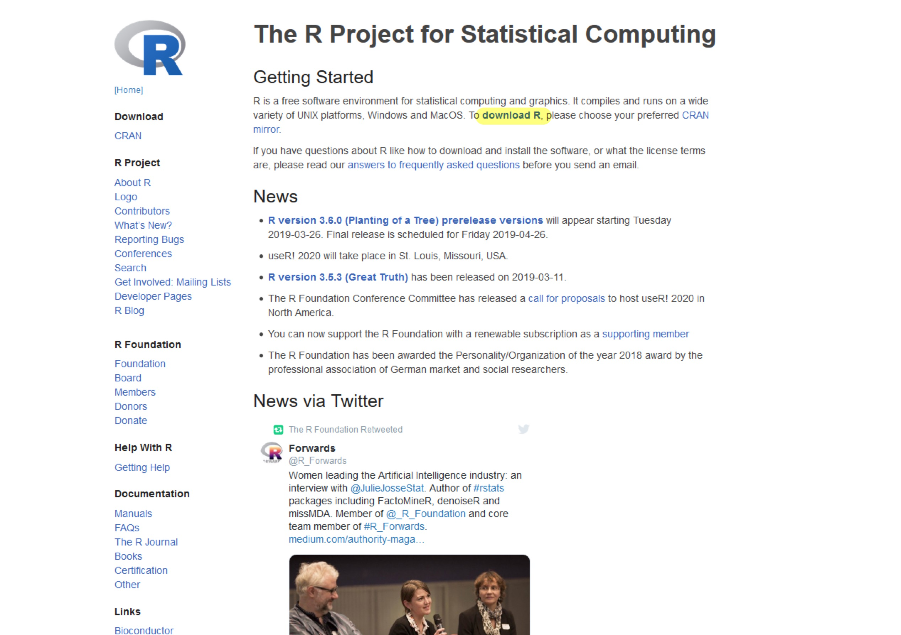
```

次にダウンロードする際のミラーサイトを選びます。
好きな国のものを選んでいいですが、ここでは日本の統計数理研究所のものを選んでおきます。

```{r, echo=FALSE}
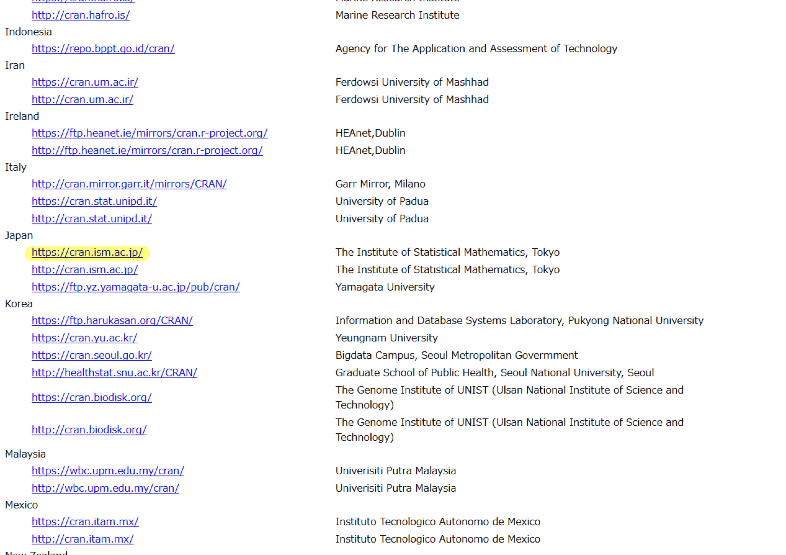
```

自分のPCのOSに応じたものを選択します。

```{r, echo=FALSE}
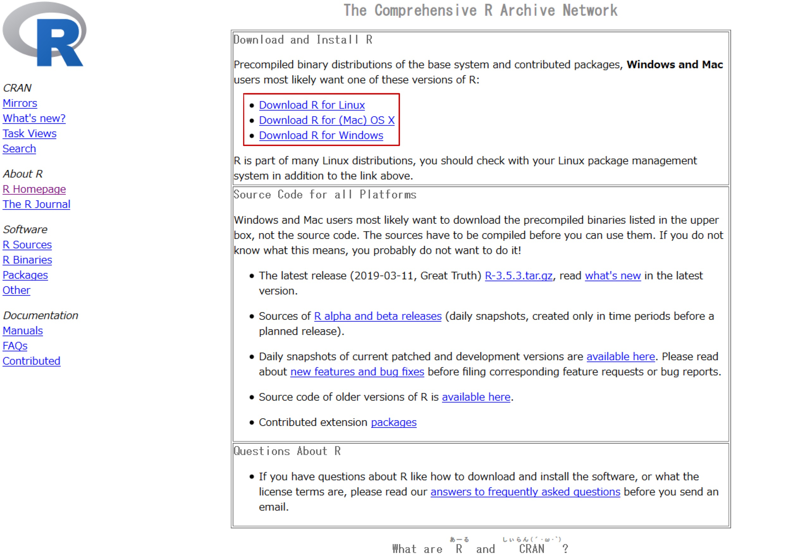
```

#### Windowsの場合

`install R for the first time`を選択します。

```{r, echo=FALSE}
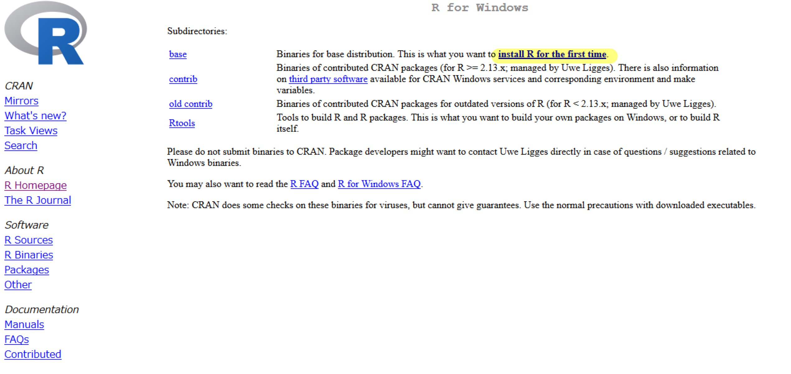
```

`Downlosd R X.X.X for YYY`を選択してダウンロードします。

```{r, echo=FALSE}
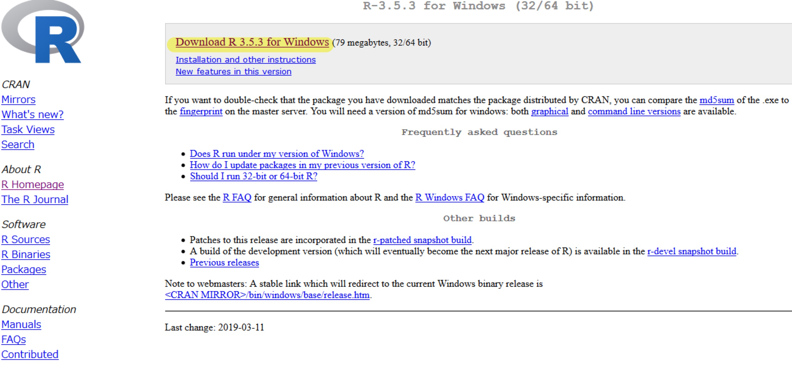
```

分かりやすいようにダウンロードフォルダにダウンロードしておきます。

Windowsの場合、Rtoolsをインストールもインストールしておきましょう。

#### Macintoshの場合

### インストール

Rをダウンロードしたフォルダを開き、ファイルをクリックします。

- ファイル名はOSによって異なります。

その後は表示されるままに進めていけばよいです。

Rは基本的にOSの言語で表示されますが、英語で使いたい場合は`Message Translations`のインストールにチェックが入っている場合は外しておきましょう。

```{r, echo=FALSE}
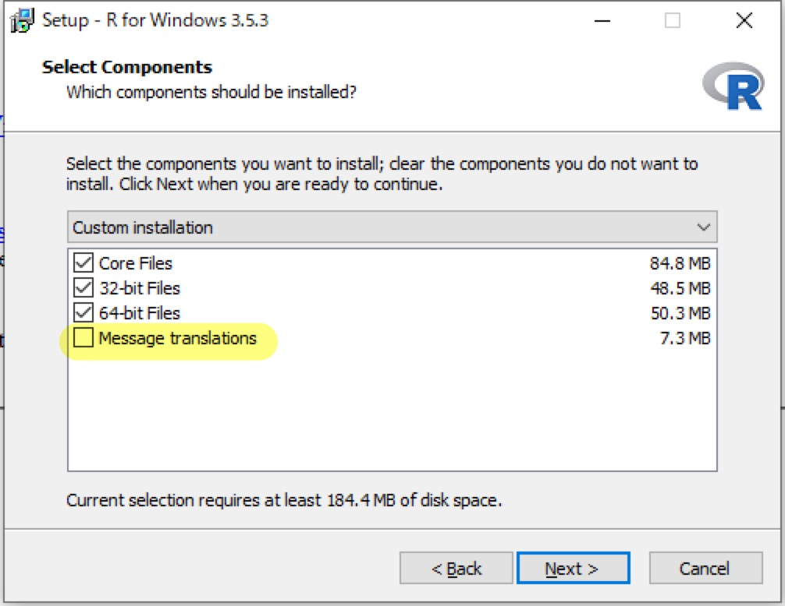
```

- 英語のエラーメッセージで検索したほうが解決策が見つけやすくなります。

## RStudioのインストール

### ダウンロード

RStudioの[公式サイト](https://www.rstudio.com/)からRStudioのダウンロードサイトへ行きます。

```{r, echo=FALSE}
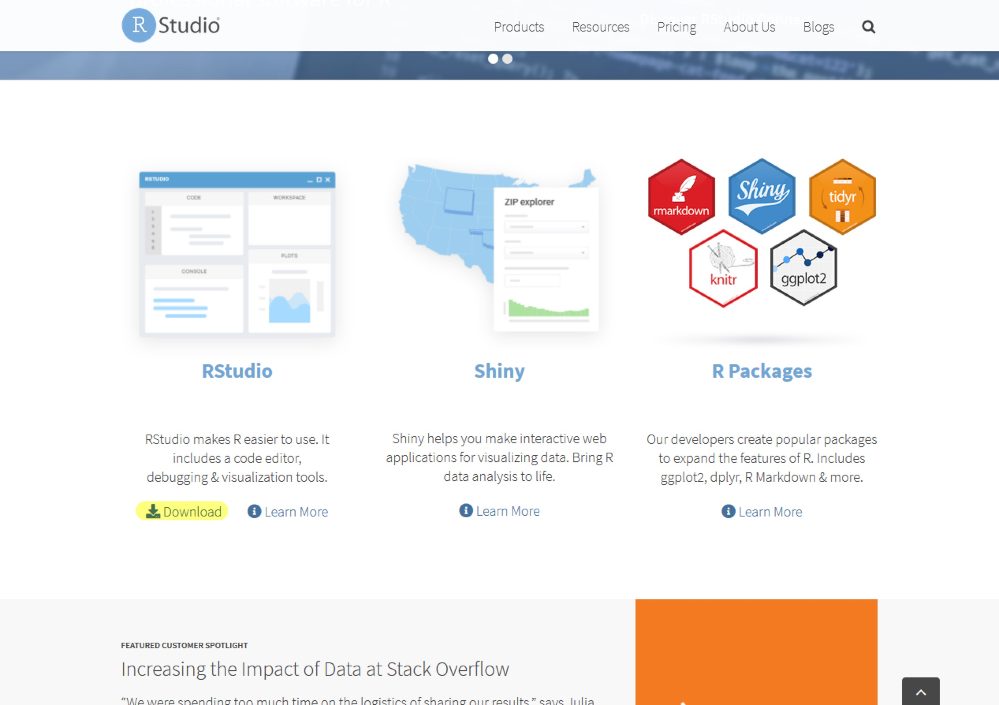
```

下の方にインストーラーをダウンロードするリンクがあるのでOSに応じたものを選択します。

```{r, echo=FALSE}
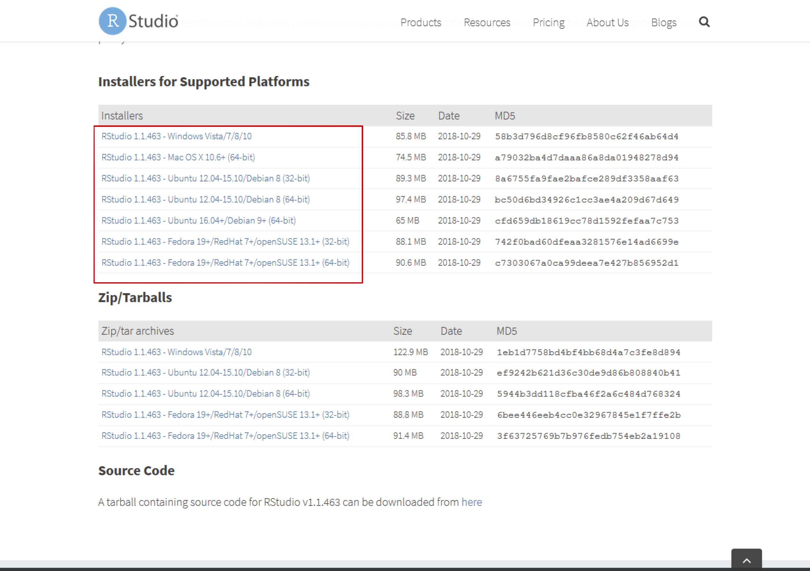
```

- 安定版ではないけれど最新のRStudioを使いたい人は[RStudio Preview](https://www.rstudio.com/products/rstudio/download/preview/)をインストールしてください。
- また、RやRStudioをインストールせずにオンラインで使用できる[RStudio Cloud](https://rstudio.cloud/)というものもあります。

### インストール

あとはダウンロードしたフォルダに移り、インストーラーを起動して表示されるがままに進めていきます。

### RStudioの起動

RStudioのショートカットをクリックしたり、メニューで`RStudio`と入力してクリックすると起動するはずです。

RStudioを初めて起動すると次のような表示になるとはずです。
左側の大きなパネルで`R`が表示されていればインストールの成功です。

```{r, echo=FALSE}
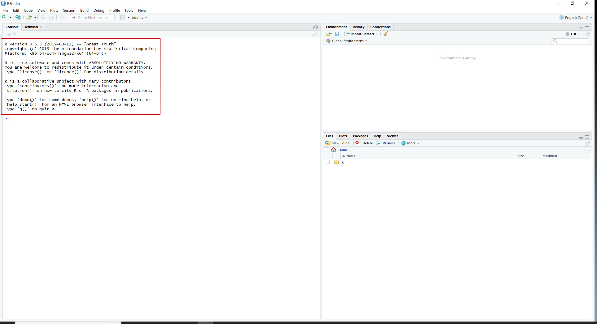
```

ちなみに、`Tools > Global Options > Appearance`ではフォントや背景・ハイライトの色を変えることができます。

```{r, echo=FALSE}
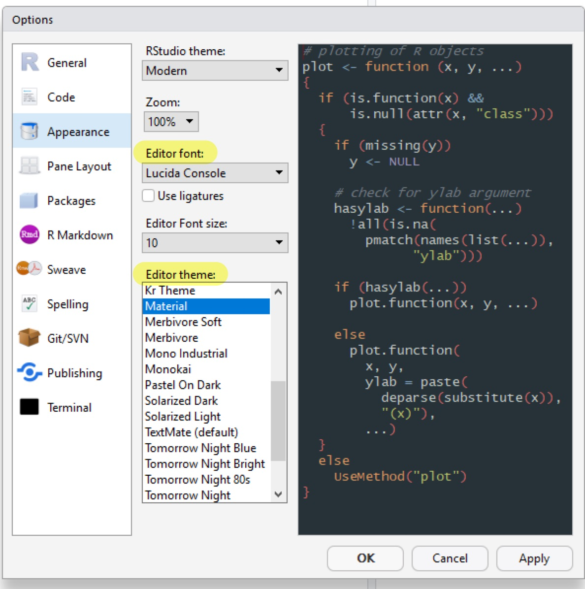
```

ダークな背景を選択するとRStudio全体もダークテーマになります。

```{r, echo=FALSE}
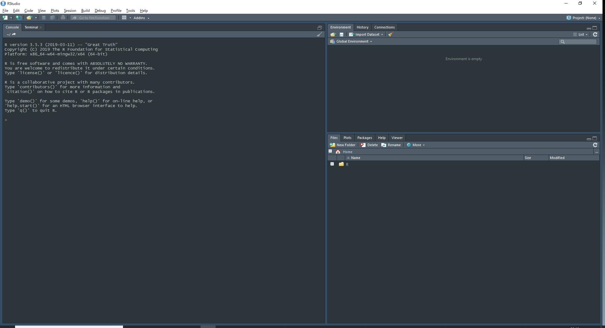
```

### RStudio Cloud*

[RStudio CLoud](https://rstudio.cloud/)により、RStudioをブラウザを使ってオンラインで使用することができます。
複数のユーザーで共同作業を行うことも可能です。

- LinuxユーザーはRStudio Serverを使って自らサーバを立てることもできます。

## 再現可能な分析のために

再現可能性 (replicability) とは、狭義では、誰がどんな環境で分析しても。オリジナルの分析結果と（ほぼ）同じものを得られることだと思っています。
以下では、再現可能性を担保できるようなR/RStudioの使い方を解説します。

### Rスクリプト

まず、分析の手順を記録に残し、公開する必要があります。
RではRスクリプトと呼ばれるファイル（拡張子は`.R`）を作成し、そこにコードを残して起きます。

- もちろん、使用したデータも公開する必要があるのは言うまでもありません。

#### Rスクリプトの作成

RStudioでは左上の`File > New File > RScript`もしくは白い紙に緑色のプラスマークのボタンを押して`R Script`を選択します。

```{r, echo=FALSE}
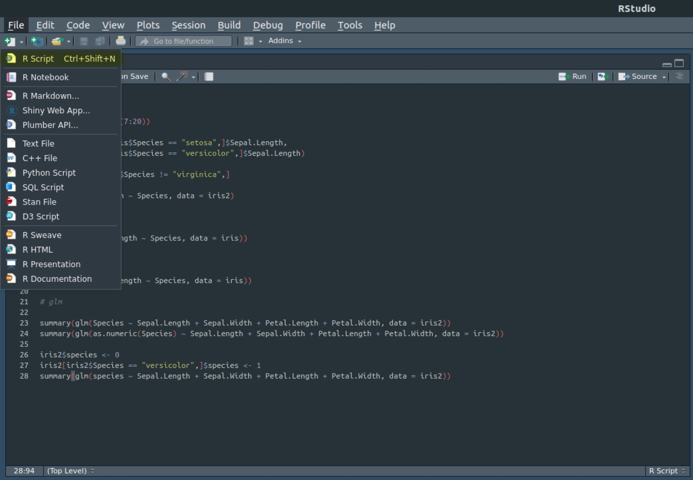
```

すると、デフォルトでは左上のパネルにRスクリプトのエディタが表示されます。

```{r, echo=FALSE}
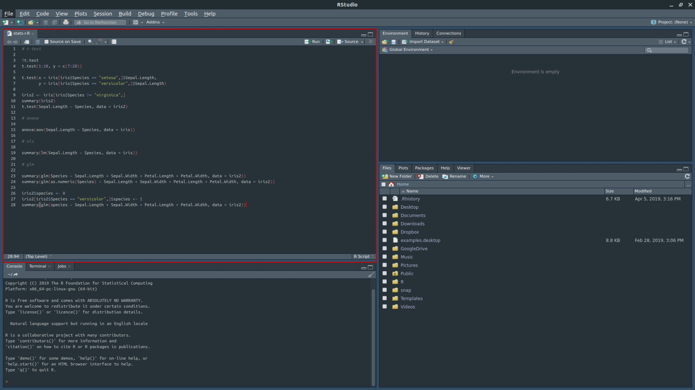
```

#### Rスクリプトの展開

RスクリプトをRStudioで開くには左上の`File > Open File`で選択します。

#### Rスクリプトの実行

Rスクリプトに書かれたコードは`Ctrl + Enter`を押すと、カーソルのある行がコンソールに流れ、実行されます。

### Rプロジェクト

[データの読み込み]で解説したように、データの読み込みや保存の際には起点となる作業ディレクトリ (working directory) を決める必要があります。

一般的に、作業ディレクトリはPCによって変わってしまうので、Rプロジェクトを立てることでその問題を回避します。
簡単に言えば、Rプロジェクトをクリックすることで自動的に作業ディレクトリが設定された状態でRStudioを起動することができます。

また、プロジェクトごとにRStudioを起動できるので、異なるプロジェクト間でデータやRスクリプトが混在することも回避できます。

ひとまず、**新しい分析を行う際は必ずRプロジェクトを作成する**ようにしましょう。

#### Rプロジェクトの作成

まずは、プロジェクトの作り方ですが、RStudioの左上の青いボタンをクリックします。

```{r, echo=FALSE}
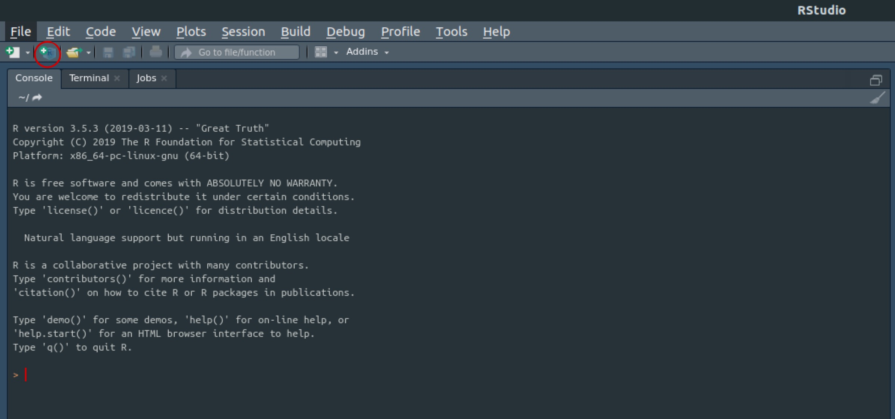
```

続いて、新たにプロジェクト用のフォルダを作るのであれば`New Directory`を、既存のフォルダをプロジェクト用にするのであれば`Existing Directory`を選択します。

```{r, echo=FALSE}
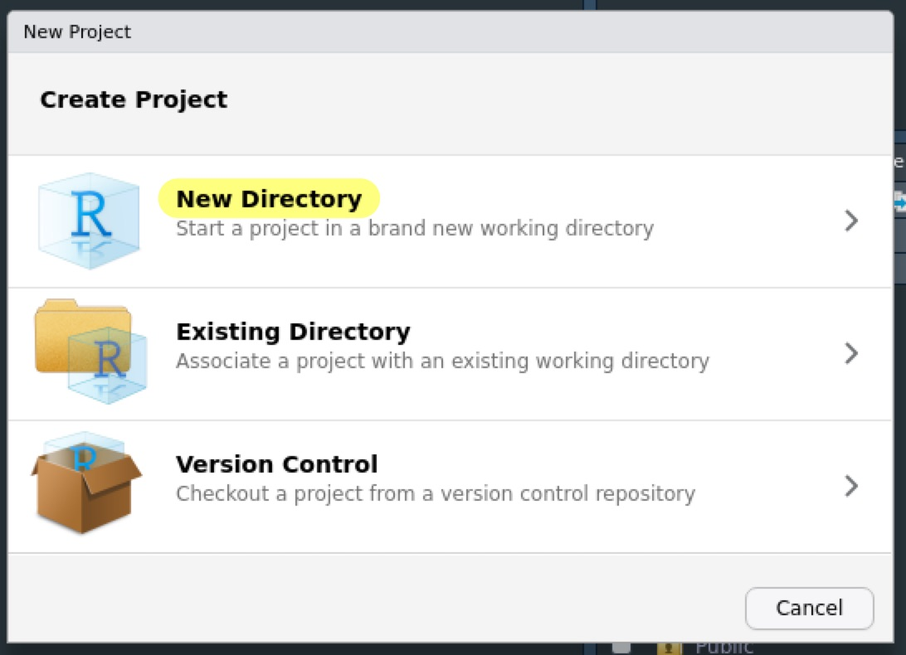
```

基本的には`New Project`を選択します。

```{r, echo=FALSE}
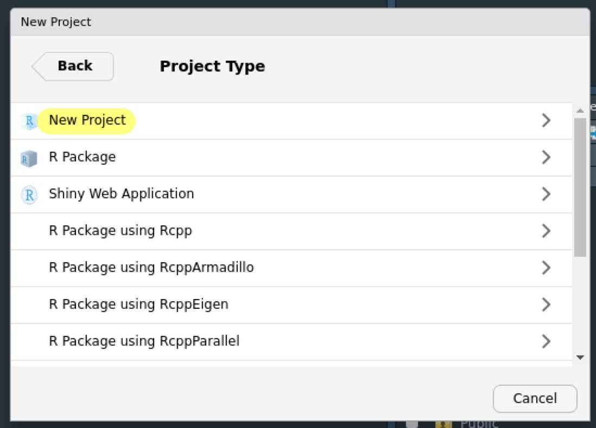
```

最後に、プロジェクト用のフォルダの名前とそのフォルダを置くフォルダのパスを指定して`Create Project`をクリックします。

- フォルダ名は必ず英数字と-や_で書き、**日本語は避けましょう**。
- 既存のフォルダを使う場合はパスを指定するだけです。

```{r, echo=FALSE}
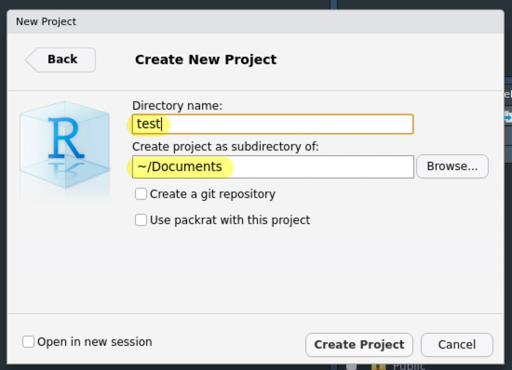
```

- 例えば今回は`Documents`フォルダの中に`test`という名前のプロジェクトを作成しました。

一度、RStudioを終了し、先程指定したパス通りの場所にフォルダができていることを確認してください。
そのフォルダの中に、プロジェクト名と同じ名前の`.Rproj`ファイルができているはずです。

#### プロジェクトの起動

それをダブルクリックしてみるとRStudioが起動されます。
このとき、すでに作業ディレクトリはプロジェクト用フォルダに指定されているのです。

- `getwd()`で作業ディレクトリを確認してみて下さい。

#### ワークスペースの保存と再開*

どうしても一度分析を中断して、再開したい場合はワークスペースを保存しておきましょう。
上記画面で`Save workflow to .RData on exit`が`Ask`になっている場合、RStudioを終了する際にワークスペースを保存するのか聞かれるはずなので、保存します。

- ちなみに、`.RData`ファイルはRのワークスペース（の一部）を保存するデータ形式です。

すると、フォルダ内に`.RData`ファイルができるので、再開するときに`load()`に当該ファイルのパスを入力して実行するとワークスペースが復元されます。

### RStudioの設定*

#### RStudio起動時の挙動

`Tools > Global Options`を開き、`Genral`の中で以下のチェックを外します。

```{r, echo=FALSE}
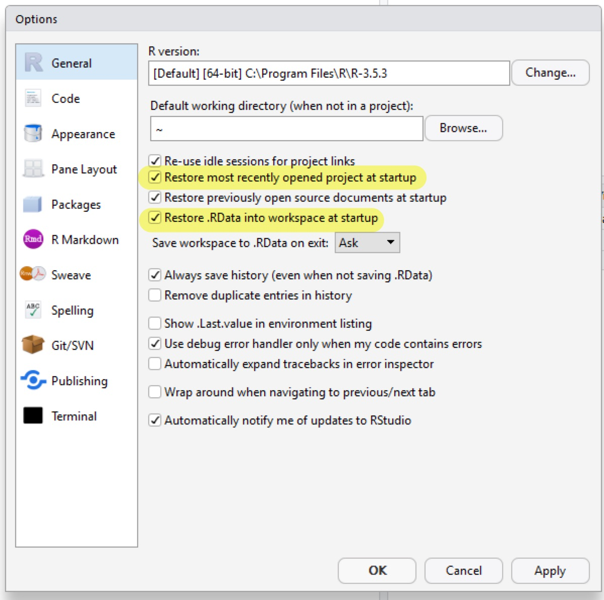
```

平たく言うとRStudioを起動したときに前回の続きが残っていない真っさらな状態にしておきます。

#### 文字コード

日本語がしばしば文字化けすることがあります。
なぜならWindowsではShift-JIS、LinuxとMacではUTF-8と呼ばれるエンコーディング（平たく言うとPCが文字を表示する方法）形式だからです。

- 詳しくは[Rにおける文字コード](encoding-r.html)を参照して下さい。

UTF-8が世界的に使われているので、`Code > Saving > Default text encoding`を`UTF-8`にしておきます。

```{r, echo=FALSE}
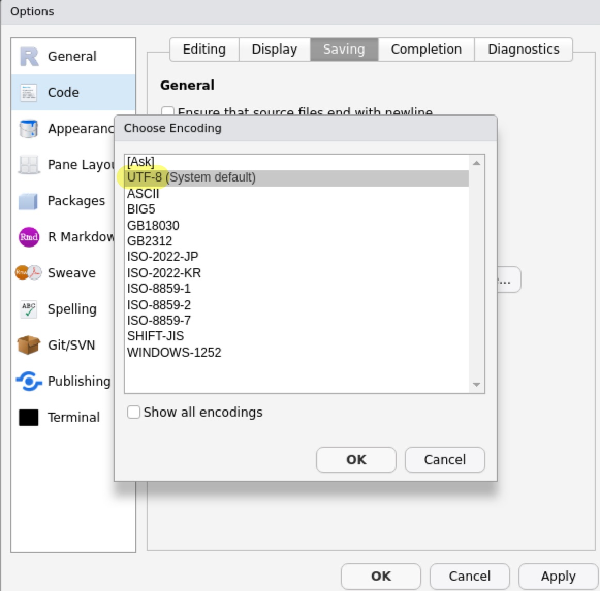
```

もし、日本語を含むファイルをRStudioで開いたときに文字化けしている場合、Windowsを使っている人はUTF-8のファイルをShift-JISで開いたということなので、`File > Reopen with Encoding`で`UTF-8`を選択します。

逆にMacの場合はShift-JISのファイルをUTF-8で開いているので同様に`Shift-JIS`で開きます。

- Windowsの人はUTF-8をデフォルトのエンコーディングにしてしまうといいでしょう。
