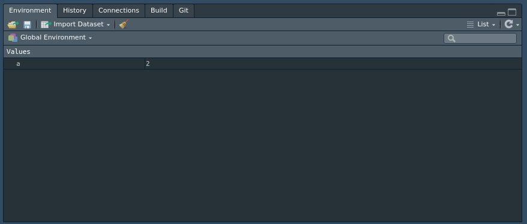
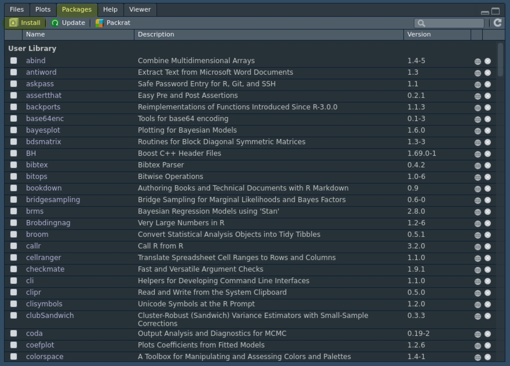
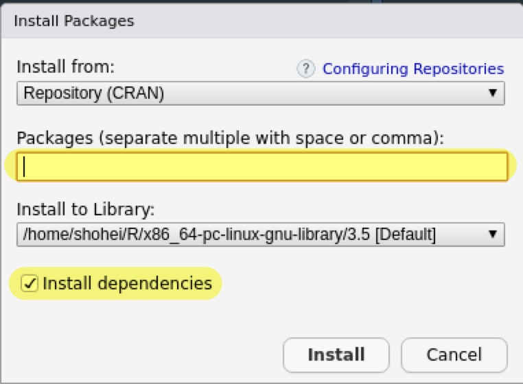

# Rプログラミング入門 {#intro-r}

Rによるプログラミングの基本として、

- [オブジェクト]
- [関数]
- [パッケージ]

について解説します。

大雑把に言えば、Rではオブジェクトとしてデータを読み込み、関数によってオブジェクト（＝データ）の処理や分析を行います。
パッケージによって様々な関数を追加することで、処理や分析の幅を広げます。

RStudioでは左（下）にコンソールが表示され、`>`の右側にコマンドを打ち込み、`Enter`を押すことで実行されます。

- 本格的に分析する場合はRスクリプトを作成します。

## 関数

**関数** (function) とは何かを入力すると、何かを出力するものです。
例えば、

```{r}
print("Hello, World.")
```

というコードは、`"Hello, World."`という文字列を`print()`という関数に入力し、その文字列を出力しています。

- Rでは、関数は`関数名()`という形を取ります。
- 入力するものを入力引数 (input argument) 、出力するものを出力引数 (output argument) と呼んだりします。

次のように、入力引数も出力引数も1つとは限りません。

```{r}
rnorm(n = 10, mean = 0, sd = 1)
```

さて、この関数は何をしているのでしょうか。
Rでは、関数名の前に`?`をつけて実行することで、その関数のヘルプを見ることができます。

```{r}
?rnorm
```

英語で関数の使い方が解説されていますが、`rnorm(n = 10, mean = 0, sd = 1)`は平均0、標準偏差1の（標準）正規分布に従う乱数を10個だけ生じさせています。

入力引数は`=`で明示的に指定する場合、どのような順番でも構いません。

```{r, eval=FALSE}
rnorm(mean = 0, sd = 1, n = 10)
```

入力引数を明示的に指定しない場合、ヘルプにある順番で入力します。
以下の例は上述のものと同じです。

```{r, eval=FALSE}
rnorm(10, 0, 1)
```

また、ヘルプで`mean = 0, sd = 1`のように書かれている場合、デフォルトが定められています。
実行者が入力引数を指定しない限り、デフォルト値が使用されます。
したがって、以下の例もこれまでと同じコードです。

```{r, eval=FALSE}
rnorm(10)
```

### 総称関数*

総称関数 (generic function) とは、Rにおいて入力引数の種類に応じて挙動が変わる関数のことを指します。
例えば、`summary()`という関数はデータフレームが入力引数の場合には記述統計を表示しますが、回帰分析の結果の場合は回帰表を出力します。

総称関数のヘルプを見る場合は、以下のように、関数名に`.`をつけて入力引数の種類を書きます。

```{r}
?summary.data.frame
?summary.lm
```

## オブジェクト

Rでは`<-`でオブジェクトを作成することができます。
例えば、20個の正規分布に従う乱数を`x`という名前のオブジェクトとして作成します。

```{r}
x <- rnorm(20)
```

- RStudioでは`<-`はショートカット`Alt + -`で入力できます。

実際に、乱数が`x`に格納されていることが分かります。

```{r}
x
```

RStudioの場合、右上の`Environment`パネルに生成されたオブジェクトが表示されます。

```{r, echo=FALSE}

```

オブジェクトを入力引数とすることも可能です。
`x`の平均と標準偏差を求めてみます。

```{r}
mean(x)
sd(x)
```

もちろん、出力引数を新しいオブジェクトにすることもできます。

```{r}
x.mean <- mean(x)
x.mean
```

- オブジェクトの名前にはアルファベットと数字、`.`と`_`が使えます。
- ただし、数字は最初の文字としては使えません。

オブジェクトは上書きすることもできます。

```{r}
x.mean <- mean(rnorm(20))
x.mean
```

- 先ほどとは違う値に上書きされていることが分かります。

## パッケージ

大雑把に言って、Rによるデータ分析は**データをオブジェクトとして読み込み、いろいろな関数で処理を行うこと**で実行します。

つまり、関数が重要なのですが、Rで標準に備わっている関数には限界があります。
そこで、様々な研究者が関数を作成し、それをまとめたものを**パッケージ**として公開しています。

- 基本的に、[CRAN](https://cran.r-project.org/)でパッケージは公開されます。
- ライブラリやモジュールと呼んだりすることもあります。

### CRANからのインストール

パッケージをインストールするには、`install.packages()`という関数にパッケージ名を入れて実行します。
試しに、[Tidyverse](https://www.tidyverse.org/)という幅広く使われているパッケージをインストールしてみます。

```{r, eval=FALSE}
install.packages("tidyverse")
```

`"`でパッケージ名を囲まないとエラーになります。

```{r, error=TRUE}
install.packages(tidyverse)
```

RStudioの場合、`Packages`パネル（デフォルトの場合は右下）の中に`Install`というボタンがあり、

```{r, echo=FALSE}

```

そこにパッケージ名を入力してインストールすることも可能です。

```{r, echo=FALSE}

```

インストールしたパッケージに対して再び`install.packages()`を行うと、最新版にアップデートされます。

- RStudioの場合、`Packages`パネルに`Update`というボタンがあり、アップデートできるパッケージを自動検索してくれます。

### GitHubからのインストール*

パッケージの開発版や一部のパッケージは[GitHub](https://github.com/)上で公開されています。

GitHub上のパッケージをインストールする場合は`devtools`というパッケージを使うので、まずはインストールと読み込みを行います。

```{r, eval=FALSE}
install.packages("devtools")
library(devtools)
```

インストールには`install_github()`を使いますが、入力はパッケージ名ではなく`ユーザー名/レポジトリ名`となる点に注意してください。

### パッケージの読み込み

パッケージはインストールしただけでは使用することはできず、`library()`で読み込む必要があります。

```{r}
library(tidyverse)
```

- この場合は`"`で囲む必要はありません。
- インストールは一回で十分です。

RStudioであれば`Packages`パネルにインストール済みのパッケージ一覧があるので、パッケージ名をクリックすると含まれる関数一覧を見ることができます。

- 同様のものは[CRAN](https://cran.r-project.org/)でも`pdf`形式で見ることができます。
- 一部のソフトウェアは[Journal of Statistical Software](https://www.jstatsoft.org/index)などで論文が公開されています。

### `tidyverse`とは*

Tidyverseとは広義にはRにおけるデータ処理を行うためのパッケージを開発するプロジェクトであり、狭義にはそこで開発されたパッケージの一部を指します。
具体的には、

- `ggplot2`
- `dplyr`
- `tidyr`
- `readr`
- `purrr`
- `tibble`
- `stringr`
- `forcats`

になります。

パッケージとしての`tidyverse`を読み込むことで、上記のパッケージを読み込んでいます。

なお、プロジェクト全体としては、上記のもの以外にも多くのパッケージが開発されています。