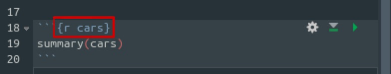
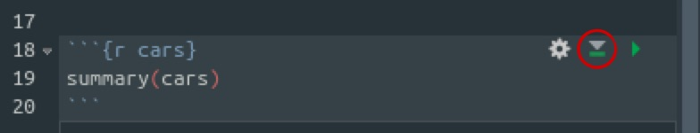

# R Markdown: html {#r-markdown-html}

データ分析の再現可能性の必要性は論を俟たないですが、再現可能性を担保するにはレプリケーションデータやコードを公開するだけでなく、それらが理解可能である必要があります。

- 恐ろしいことに自分が書いたコードでさえ数カ月後に読み返すと意味がわからないことはまれによくあります。

Rスクリプトに`#`でコメントするのが単純な方法ですが、データ分析においてはしばしば文章とコード、アウトプットを混在させたノートブックを使用することがあります。

- 詳しくはないですが文芸的プラグラミングと呼ばれるものの一種のような気がします。

更にノートブックからより見やすいファイルを作成することができ、そのファイルおよびシステムを**R Markdown**と呼びます。
実は、と言うほどではないですが、このブログもR Markdownで書かれています。

## R Markdownファイルの作成

百聞は一見に如かずなので、一まずはR Markdownを使ってみます。
まず、左上のファイルを作成するボタンを押し、`R Markdown...`を選択します。

```{r, echo=FALSE}
knitr::include_graphics("figures/rmarkdown_html1.jpg")
```

- 初めてR Markdownを使う場合は必要なパッケージをインストールするか聞かれるのでインストールを選択します。

続いて、どのような種類のR Markdownファイルを作成するかを選択するので、（デフォルトのままですが）`Document`の`HTML`を選択します。

```{r, echo=FALSE}

```

すると、エディタに以下のようなサンプルの`Rmd`ファイルが表示されます。
適当なフォルダに保存し、エディタ上部の`Knit`をクリックするか`Shift + Ctrl + k`を押すとR Markdownファイルがタイプセットされます。

```{r, echo=FALSE}
knitr::include_graphics("figures/rmarkdown_html3.jpg")
```

無事、タイプセットに成功すると以下のような`.html`ファイルのプレビューが表示されます。

```{r, echo=FALSE}
knitr::include_graphics("figures/rmarkdown_html4.jpg")
```

`.Rmd`ファイルを保存したフォルダに`.html`ファイルが生成されているはずです。
`.html`ファイルとはウェブサイトを作成するためのファイルで、ウェブブラウザ（例、FirefoxやGoogle Chrome）で開くことできれいに見れます。

### 参考になるサイト

- [R Markdownの公式サイト](https://rmarkdown.rstudio.com/)
- [R Markdown: The Definitive Guide](https://bookdown.org/yihui/rmarkdown/)
- [R Markdownのチートシート (pdf)](https://www.rstudio.com/wp-content/uploads/2015/02/rmarkdown-cheatsheet.pdf)
- 比治山大学の前田和寛先生の[R Markdown入門](https://kazutan.github.io/kazutanR/Rmd_intro.html)

## Markdown記法

### Markdownとは*

R MarkdownとはMarkdownとRスクリプトを合体させたようなものです。
ここではMarkdownについて説明しますが、読み飛ばしても構いません。

Markdownとは計量マークアップ言語と呼ばれているように[マークアップ言語](https://ja.wikipedia.org/wiki/%E3%83%9E%E3%83%BC%E3%82%AF%E3%82%A2%E3%83%83%E3%83%97%E8%A8%80%E8%AA%9E)の一種です。
マークアップ言語とは文章の中身と役割・外見を区別して記述する言語です。

逆に、世間で普及しているWordのように文章の中身と役割・外見が混在しているエディターは[WYSIWYG](https://ja.wikipedia.org/wiki/WYSIWYG)と呼びます。

例えば、Wordではセクションの名前などは指定することができますが、見た目はフォントのサイズが大きくなったり、太字になったりします。
一方で、マークアップ言語の一種である`.html`ファイルでは

```{}
<h1>セクションタイトル</h1>
```

のように明示的に`h1`というタグをつけ、`h1`タグのついている文章に対して`.css`ファイルで見た目を決定します。
同様に、LaTeXでは`\section{セクションタイトル}`のようにタグをつけます。

基本的にはWYSIWYGなソフトのほうが直観的な操作が可能で作業が楽ではあるものの、マークアップ言語はテキストで役割や外見も決めるので再現可能性が高いと言えるでしょう。

そこで、より簡便なマークアップ言語として登場したのがMarkdown記法です。
なので、HTML記法を使うこともできます。

### セクション

Markdownでは`#`を使ってセクションのタイトルを記述します。
`#`が多くなればなるほどより小さな見出しになります。

```{}
# レベル1
## レベル2
### レベル3
#### レベル4
```

### パラグラフ

空行を入れると新しいパラグラフになります。

```{}
同じパラグラフです。
同じパラグラフです。
```

同じパラグラフです。
同じパラグラフです。

```{}
違うパラグラフです。

違うパラグラフです。
```

違うパラグラフです。

違うパラグラフです。

- なので、パラグラフ内でも一文ごとに改行したほうが見やすいと思います。

### 箇条書き

番号なしの箇条書きの場合は`=`を、番号付きの箇条書きの場合は`1.`を入れます。

```{}
- 番号なし箇条書き
- 番号なし箇条書き
- 番号なし箇条書き
```

- 番号なし箇条書き
- 番号なし箇条書き
- 番号なし箇条書き

```{}
1. 番号付き箇条書き
1. 番号付き箇条書き
1. 番号付き箇条書き
```

1. 番号付き箇条書き
1. 番号付き箇条書き
1. 番号付き箇条書き

タブ（半角スペース4つ分）を入れると階層構造をつけることができます。

```{}
- レベル1
    - レベル2
- レベル１
```

- レベル1
    - レベル2
- レベル１

### 文字の強調

`*`もしくは`_`で囲むと斜体になり、`**`もしくは`__`で囲むと太字になります。

```{}
*斜体*と**太字**
```

*斜体*と**太字**

`｀`で囲むとコードになり、`~~`で囲むと打ち消されます。

```{}
`code`と~~打ち消し~~
```

`code`と打ち消し

- 日本語のLaTeXでは打ち消しに対応していないので、表示させていません。

### 引用

`>`から始めると引用になります。

```{}
> 引用文です。
```

> 引用文です。

### リンク

リンクを貼る場合は`[リンク名](リンク先のURL)`あるいは`<リンク先のURL>`とします。

```{}
- [RStudio](https://www.rstudio.com/)
- <https://www.rstudio.com/>
```

- [RStudio](https://www.rstudio.com/)
- <https://www.rstudio.com/>

### 画像、表

画像を埋め込む場合は``とします。

```{}

```


表を埋め込む際には次のように書きます。

```{}
| 項目1 | 項目2 | 項目3 |
|-------|-------|-------|
| りんご| 100   | 赤    |
| みかん| 80    | オレンジ |
```

| 項目1 | 項目2 | 項目3 |
|-------|-------|-------|
| りんご| 100   | 赤    |
| みかん| 80    | オレンジ |

### 数式

LaTeX記法による数式を記述できます。
インラインの場合は`$`で囲み、ディスプレイの場合は`$$`で囲みます。

- `.html`の場合、`mathjax`によって数式を表示するのでオフラインでは表示できません。

```{}
確率変数$X_i$は平均$\mu$、分散$\sigma^2$の正規分布に従う。
```

確率変数$X_i$は平均$\mu$、分散$\sigma^2$の正規分布に従う。

```{}
$$
  X_i \sim \mathcal{N}(\mu,\sigma^2)
$$
```

$$
  X_i \sim \mathcal{N}(\mu,\sigma^2)
$$

## Rチャンク

R Markdown内でRコードを記述する際にはRチャンクと呼ばれるものの中で行います。
Rチャンクは次のような形をしています。
`Ctrl + Alt + I`でRチャンクを挿入することができます。

```{r, echo=FALSE}

```

まず、この部分は後述するチャンクオプションを指定する場所になります。
ここではRコードであること、チャンク名を`cars`と指定しています。

```{r, echo=FALSE}

```

R MrkdownにおいてもRスクリプトと同様に`Ctrl + Enter`でコードを実行することができます。
あるいはRチャンクの右上のボタンをクリックしても実行できます。
実行されたコードはチャンクの直下に表示されます。

```{r, echo=FALSE}

```

右上から二番目のボタンはこのRチャンクの直前のRチャンクまでのコードを全て実行するボタンになります。

### チャンクオプション

チャンクオプションを指定することでコードとそのアウトプットをどのように出力するかを制御することができます。
主なものをまとめておきます。

- `eval=FALSE`とするとコードは表示されるが実行されない。
- `echo=FALSE`とするとコードは実行されるが表示されない。
- `include=FALSE`とするとコードは実行されるがコードも実行結果も表示されない。
- `warning=FALSE`や`error=FALSE`、`message=FALSE`とすると警告やエラー、メッセージが表示されない。

例えば、`{r, echo=FALSE}`のように書きます。

デフォルトを変更したい場合は冒頭で`knitr::opts_chunk$set(echo=TRUE)`のように設定します。

## yamlヘッダー

yamlヘッダーとは`.Rmd`ファイルの冒頭で`---`によって囲まれた箇所で、ページ全体の設定を行います。
初期状態では

```{}
---
title: "Untitled"
author: "Shohei Doi"
date: "4/9/2019"
output: html_document
---
```

となっていますが、`title`や`author`、`date`でタイトル、著者、日付を設定できます。

### output

`output`によって出力形式を決定します。
これによってyamlヘッダーにおいてどのような項目を設定できるのかも決まります。

どのような出力形式が利用可能であるかは後述するとして、以下では`html_document`における主なyamlヘッダーの設定を紹介します。

- 前田先生の[ページ](https://qiita.com/kazutan/items/726e03dfcef1615ae999)が参考になります。

### 目次

目次を出力するには次のように書きます。

```{}
output:
  html_document:
    toc: TRUE
```

目次の設定には次のようなものがあります。

```{}
output:
  html_document:
    toc: TRUE
    toc_depth: 2
    toc_gloat: TRUE
    number_sections: TRUE
```

- `toc_depth`によってどの階層の見出しまで表示するかを決めます。
- `toc_float`を`TRUE`にすると目次がスクロールしてもついてきます。
- `number_sections`を`TRUE`にすると見出しに通し番号がつきます。

### テーマ

テーマを決める場合は`theme`で指定します。
テーマ一覧は[こちら](https://bootswatch.com/3/)になります。

```{}
output:
  html_document:
    theme: "paper"
```

### htmlとcss

`css`によってカスタム`.css`ファイルを指定できます。
`include`によって`.html`ファイルの挿入ができます。

デフォルトでは`.css`ファイルは画像データなどは全て`.html`ファイルに含まれてスタンドアロンな形で見ることができます。
しかし、`self_contained`を`FALSE`とすると付属ファイルは別フォルダに作成され、`.html`ファイル自体が見やすくなります。

## その他のテンプレート

`output`を変更することで、いくつかのテンプレートを使用することができます。
ここでは`.html`ファイルが出力されるいくつかのテンプレートを紹介しておきます。

- 公式サイトの[Gallery](https://rmarkdown.rstudio.com/gallery.html)や[Formats](https://rmarkdown.rstudio.com/formats.html)をご覧ください。

### Distill

[Distill](https://rstudio.github.io/distill/)はウェブで公開することを念頭に置いた専門的な記事を書くためのテンプレートになっています。
インストールは以下のように行います。

```{r, eval=FALSE}
devtools::install_github("rstudio/distill")
```

- RStudioのバージョンは1.2以上であることが求められています。

インストールに成功すると`R Markdown...`の中の`From Template`に`Distill Article`が追加されているはずです。

### Tufte Handout

[Tufte Handout](https://rstudio.github.io/tufte/)というテンプレートもあります。


`tufte`というパッケージをインストールするとテンプレートに追加されます。

```{r, echo=FALSE}

```

### rmdformats

[rmdformats](https://github.com/juba/rmdformats)というテンプレートもあります。
同様に、`rmdformats`というパッケージをインストールします。


### スライド

R Markdownから作成できる`.html`ファイルのスライドには[ioslides](https://bookdown.org/yihui/rmarkdown/ioslides-presentation.html)と[slidy](https://bookdown.org/yihui/rmarkdown/slidy-presentation.html)というものがあります。


これらはデフォルトで入っています。

```{r, echo=FALSE}
knitr::include_graphics("figures/rmarkdown_html7.jpg")
```

また、[reveal.js](https://revealjs.com/)という`.html`スライドを作ることもできます。
`revealjs`というパッケージをインストールするとテンプレートが追加されます。

- `Presentation`の方ではない点に注意。


同様にして[xaringan](https://github.com/yihui/xaringan)というNARUTOという忍者マンガにインスパイアされたテンプレートを使用することもできます。


### ダッシュボード

`flexdashboard`というパッケージを使うと[ダッシュボード](https://rmarkdown.rstudio.com/flexdashboard/)を作ることができます。
パッケージをインストールすると`Flex Dashboard`というテンプレートが追加されます。


### Microsoft Office

R MarkdownからMicrosoft OfficeのWordやPowerPointの形式のファイルを作成することも可能です。
