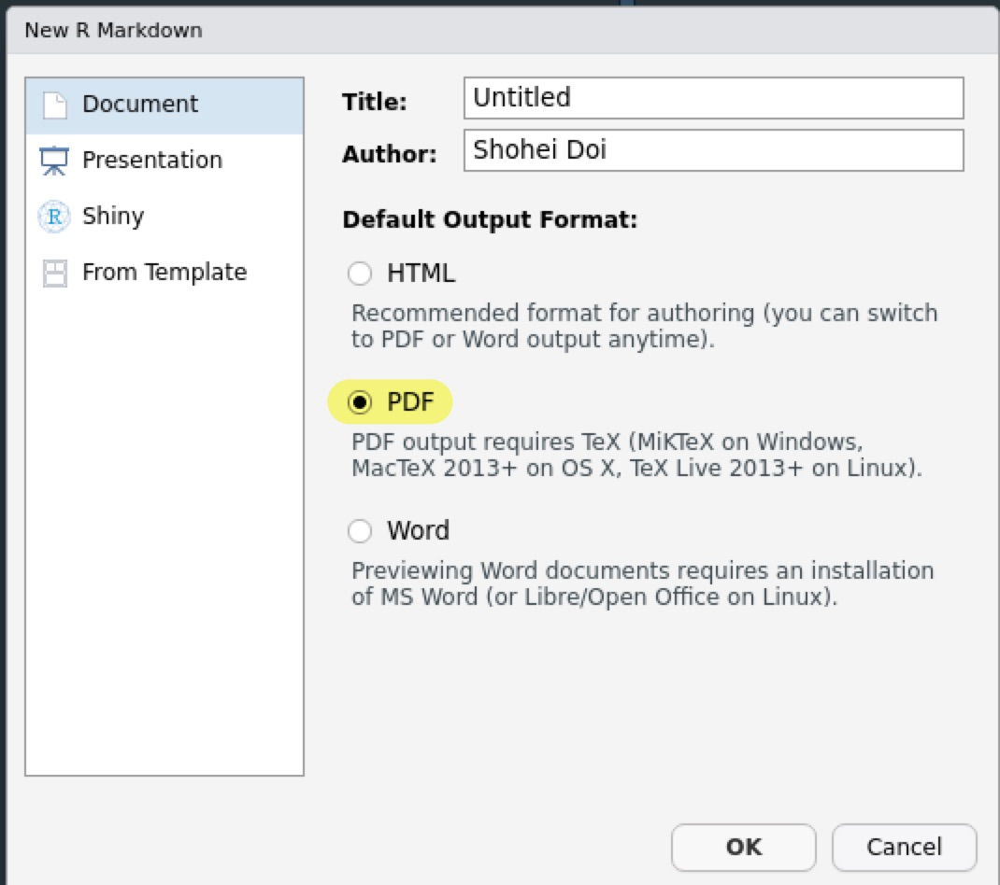
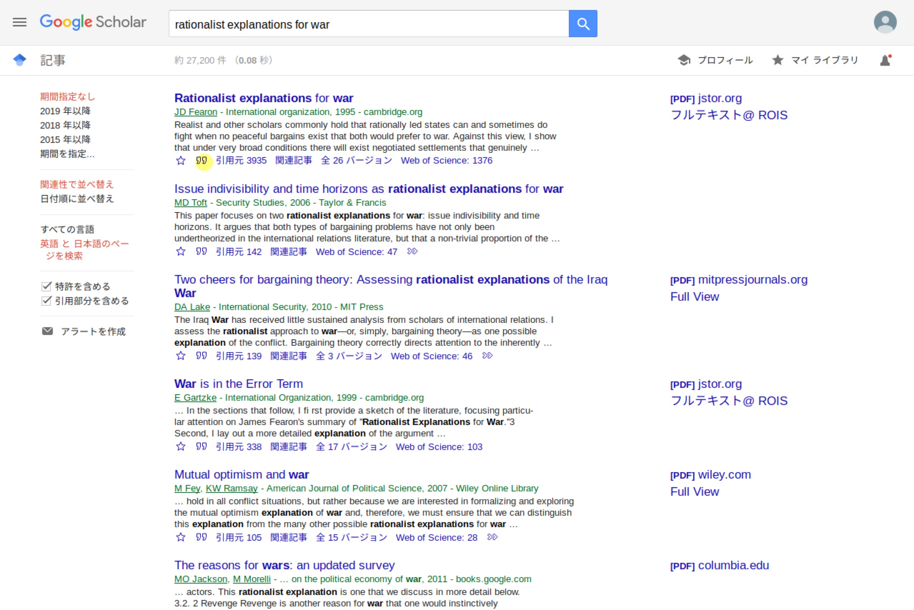
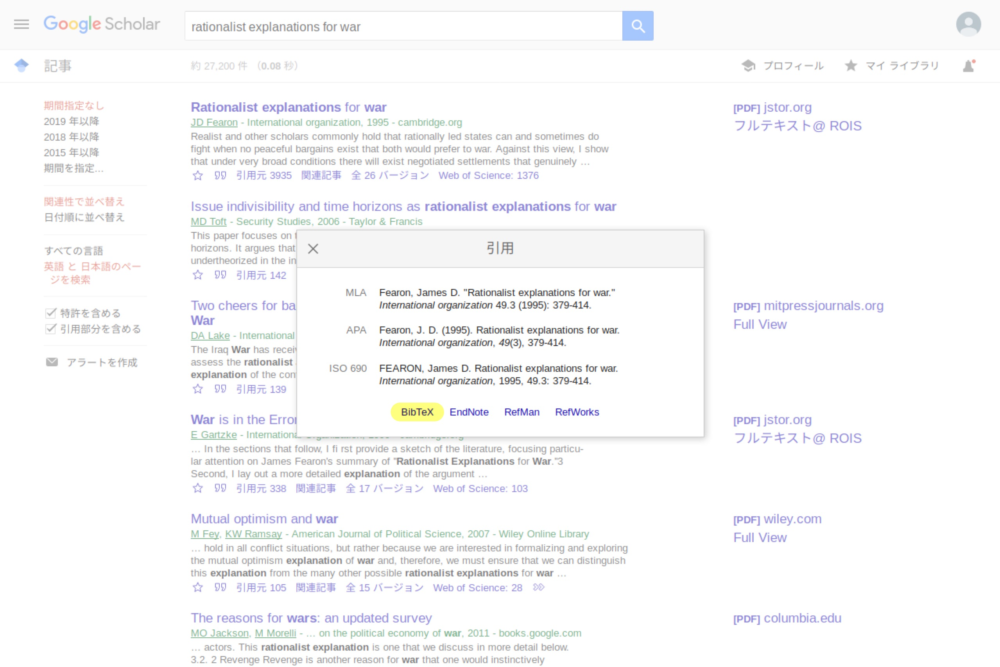

# R Markdown: pdf {#r-markdown-pdf}

R Markdownから`.pdf`ファイルを作成するにはLaTeXと呼ばれる組版システムを導入する必要があります。
一手間かかりますが、逆にR Markdownによって簡単にLaTeXを使えるとも言えます。

- [R Markdown: The Definitive Guide](https://bookdown.org/yihui/rmarkdown/)

ここではLaTeXの導入から`.pdf`形式による論文とスライドの作成、そしていくつかのLaTeX記法の紹介を行います。

## LaTeXの導入

LaTeXのディストリビューションはいろいろあるのですが、今回は[TinyTeX](https://yihui.name/tinytex/)を使って環境構築を行います。
TinyTeXはメジャーなディストリビューションである[TeX Live](https://www.tug.org/texlive/)のうち必要最小限の要素だけを含んでいます。

<aside>
  TeX Live以外にも[MikTeX](https://miktex.org/)、Windowsであれば[W32TeX](http://w32tex.org/index-ja.html)、Macでは[MacTeX](http://www.tug.org/mactex/)も有名です。
</aside>

TeX Liveは全てのパッケージを一度にダウンロードするので非常に時間がかかります。
本格的にLaTeXを使わないのであればTinyTeXで十分だと思います。

- また、[Overleaf](https://ja.overleaf.com/)というオンラインLaTeXエディタもあります。

### tinytexのインストール

`tinytex`というRパッケージがありますので、それをインストールします。

```{r, eval = FALSE}
install.packages("tinytex")
```

続いて、TinyTeX本体を以下のコマンドでインストールします。

```{r, eval = FALSE}
tinytex::install_tinytex()
```

- エラーメッセージが出てくるかもしれませんがダイアログにあるように無視して進めて問題ありません。

そこそこ時間がかかりますが、TeX Liveを使ったことがある人はあまりの速さにびっくりするかもしれません。

### タイプセット

R Markdownファイルを作成する際に`Document`の`PDF`を選択します。

```{r, echo = FALSE}

```

やはりサンプルファイルができるので、適当なフォルダに保存して`Knit`もしくは`Shift + Ctrl + K`でタイプセットすると`.pdf`ファイルが作成されるはずです。

- `.tex`からタイプセットする場合は`pdflatex()`、`lualatex()`、`xelatex()`でパスを指定して使います。

タイプセット時にいろいろとインストールを行い、時間がかかるかもしれません。
これはTiny TeXが最低限のパッケージだけを持っていて、必要なパッケージは適宜インストールするからです。
一度、パッケージをインストールすると再度インストールはしないので時間は掛かりません。

## 日本語環境の構築

残念ながら、デフォルトの状態では日本語を含むファイルをタイプセットすることはできません。
実際に、サンプルファイルに適当な日本語を入れてタイプセットしてみるとエラーが出るはずです。

今回はXeLaTeXによる日本語ファイルのタイプセットを目指します。

- Windowsでしか確認していないのでMacではうまくいかないかもしれません。
その時は教えてください。

### LaTeXエンジンのあれこれ*

なぜXeLaTeXを使うのかについて説明しますが読み飛ばしても構いません。

僕も詳しくはないですが、LaTeXエンジンにはいろいろな種類があります。
モダンなエンジンはpdfLaTeX、LuaLaTeX、XeLaTeXと呼ばれています。

- 例えば、[こちら](https://qiita.com/yyu/items/6404656f822ce14db935)を参照。
- 実際にR MarkdownやTinyTeXで対応しているのはこの3つになります。
- Overleafでもこの3つにpLaTeXを加えたものに対応しています。

一方で、日本語ファイルをタイプセットする際にこれまで用いられてきたのは[u]pLaTeXと呼ばれるエンジンです。
しかし、今後は徐々にモダンなエンジンが主流になると思われます。

このうち、pdfLaTeXでは日本語を扱えないので選択肢はLuaLaTeXとXeLaTeXのどちらかになります。
どうやら、LuaLaTeXが主流となりつつあるらしく、またLuaと呼ばれる言語を使えるという利点もありそうです。

しかし、僕はLuaが何なのか分かりませんし（したがって、どんなご利益があるのかも知りません）、XeLaTeXの方がタイプセットの速度が早いらしいので、現時点ではこちらを使用しています。

### yamlヘッダー

XeLaTeXによってR Markdownから`.。pdf`ファイルを生成するにはyamlヘッダーの`output`以下を次のようにします。

```{}
output:
  pdf_document: 
    latex_engine: xelatex 
    number_sections: true
documentclass: bxjsarticle
header-includes: 
  - \usepackage{zxjatype} 
  - \usepackage[ipa]{zxjafont} 
geometry: no
```

- 目次を出力する際は`.html`の時と同様に設定します。
- フォントの大きさは`fontsize: 10pt`のように指定します。

### フォントのインストール

もしIPAexフォントがPCに入っていない場合は以下のコマンドでインストールします。

```{r, eval = FALSE}
tinytex::tlmgr_install("ipaex")
```

あるいは[こちら](https://ipafont.ipa.go.jp/old/)からダウンロード&インストールします。

この状態でタイプセットすると日本語も表示されるはずです。

### その他のテンプレート

`.html`の時と同様に`.pdf`のときもいくつかの[rtciles](https://github.com/rstudio/rticles)にテンプレートが用意されています。
`rticles`というパッケージをインストールするとテンプレートが追加されます。

### Sumatra PDF

おそらく、Adobe AcrobatがPDFリーダーとしては人気だとは思いますが、Acrobatで開いている`.pdf`ファイルを編集することはできないという欠点があります。

そこで、[Sumatra PDF](https://www.sumatrapdfreader.org/download-free-pdf-viewer.html)などのPDFリーダーを使用することがおすすめです。

## スライドの作成

LaTeXでスライドを作成する際によく用いられているのが[Beamer](https://ja.wikipedia.org/wiki/Beamer)と呼ばれるドキュメントクラスです。
R MarkdownからBeamerスライドを作成することも可能です。

- 京都府立大学の秦先生がPowerPointでBeamer風のスライドを作るため[テンプレート](http://hatam.sakura.ne.jp/nisebeamer.html)を公開しています。


まず、`Presentation`の中の`PDF (Beamer)`を選択します。

```{r, echo = FALSE}
knitr::include_graphics("figures/rmarkdown_pdf2.jpg")
```

そして、yamlヘッダーの`output`以下を次のように書き換えます。

```{}
output: 
  beamer_presentation:
    latex_engine: xelatex 
header-includes: 
  - \usepackage{zxjatype} 
  - \usepackage[ipa]{zxjafont} 
```

- スライドでは`#`がセクションタイトル、`##`が各スライドのタイトルになります。
- `classoption: "aspectratio=169"`とするとアスペクト比が16:9になります。

### テーマ

Beamerにはデフォルトで多くの[テーマとカラー](https://hartwork.org/beamer-theme-matrix/)があります。
以下のようにして設定することができます。

```{}
output:
  beamer_presentation:
    theme: "AnnArbor"
    colortheme: "dolphin"
    fonttheme: "structurebold"
```

## LaTeX記法

もちろん、Markdown記法はそのまま使うことができます。
LaTeXもhtmlと同様にマークアップ言語であり、専用の記法があります。
Markdown記法ではできないことはLaTeX記法で直接書き込むことで可能になります。

### 定理環境

定理や仮説を書くときには、まずyamlヘッダーに以下を付け加えます。

```{}
header-includes:
  - \usepackage{amsthm}
  - \newtheorem{hypo}{仮説}
```

そして仮説を書くときには次のように書きます。

```{}
\begin{hypo}
  Xが大きくなるとYも大きくなりやすくなる。
\end{hypo}
```

### 数式

数式はインラインであれば`$`で、ディスプレイであれば`$$`で囲みます。

#### 添字

上付きの添字は`~`で、下付きの添字は`_`で書きます。
複数の文字列をまとめるときは`{}`で囲みます。

```{}
$x^n, y_{it}$
```

$x^n, y_{it}$

#### 太字

数式内で太字にする場合は`\mathbf{}`を使います。

```{}
$\mathbf{x}$
```

$\mathbf{x}$

#### 条件

条件に応じて値が変わる場合は次のように書きます。

```{}
$$
  T_i = 
  \begin{cases}
    1 & もしiさんが処置群にいた場合 \\
    0 & そうでない場合 \\
  \end{cases}
$$
```

$$
  T_i = 
  \begin{cases}
    1 & もしiさんが処置群にいた場合 \\
    0 & そうでない場合 \\
  \end{cases}
$$

## 参考文献と引用

R Markdownでは文献ファイルから引用と参考文献を作成することができます。
[いろいろな形式](https://rmarkdown.rstudio.com/authoring_bibliographies_and_citations.html)に対応しているようですが、ここではLaTeXでよく使われている`.bib`ファイルを使います。

### .bibファイル

`.bib`ファイルは文献情報を保存する形式の一つです。

まず、RStudioでも他のテキストエディタでもいいので、`.Rmd`ファイルがあるディレクトリに`.bib`ファイルを作成します。
ここでは`reference.bib`という名前で作成したとします。

[Google Scholar](https://scholar.google.co.jp/)に登録されている文献であれば次のように`bib`形式の情報を取得することができます。

<aside>
  ただし、Google Scholarの文献情報はいい加減であることも多いので気をつけてください。
</aside>

まず、引用したい文献を検索します。
続いて、引用したい文献の引用ボタンをクリックします。

```{r, echo = FALSE}

```

そして、`BibTeX`ボタンをクリックすると`.bib`形式の書誌情報が表示されます。

```{r, echo = FALSE}

```

```{}
@article{fearon1995rationalist,
  title={Rationalist explanations for war},
  author={Fearon, James D},
  journal={International organization},
  volume={49},
  number={3},
  pages={379--414},
  year={1995},
  publisher={Cambridge University Press}
}
```

これを先ほど作成した`reference.bib`にコピペして保存します。

- 直接`.bib`ファイルを編集したい場合は[JabRef](http://www.jabref.org/)などのソフトを使うといいでしょう。
- [Mendeley](https://www.mendeley.com/)を使うと`/pdf`ファイルを取り込んで自動で`.bib`ファイルを作成してくれます。

### 文献の引用

引用する際には`[@citation_key]`という形で記述します。
`citation_key`とは書誌情報の最初の要素（この場合は`fearon1995rationalist`）になります。
したがって、`[@fearon1995rationalist]`と記述すると引用ができます。

- Google Scholarの場合は自動で引用キーが生成されますが長いので適当なものに書き直したほうが楽です。

### 日本語文献の引用

日本語文献の場合も概ね同様の方法で行います。
ただし、Google Scholarに収録されていないことも多いので次のようなサービスも利用できます。

- [Lead2Amazon](http://lead.to/amazon/jp/)でAmazonの検索結果からBibTeX情報を取り出す。
- [CiNii](https://ci.nii.ac.jp/)には標準でBibTeXをエクスポートする機能があります。

例えば、Lead2Amazonで取り出した高坂正堯の「国際政治」の書誌情報は以下のようになります。
ただし、このまま引用すると、名前と名字が入れ替わって表示されてしまうので、名字の後ろに`,`をつける必要があります。

```{}
@BOOK{高坂201710,
title={国際政治 - 恐怖と希望 (中公新書)},
author={高坂 正堯},
publisher={中央公論新社},
year={2017},
month={10},
edition={改},
isbn={9784121801081},
url={http://amazon.co.jp/o/ASIN/4121801083/},
totalpages={233},
timestamp={2019.04.10},
}
```

- 本格的に日本語文献を適切な形で表示するには[jecon.bst](http://shirotakeda.org/ja/tex-ja/jecon-ja.html)のようなBibTeXスタイルファイルを使う必要があります。